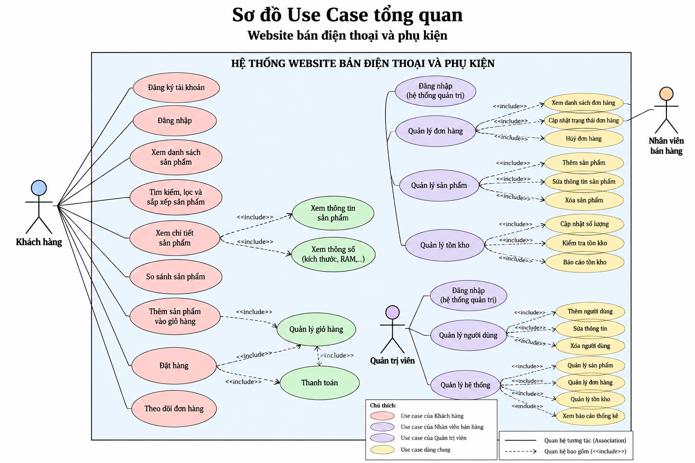
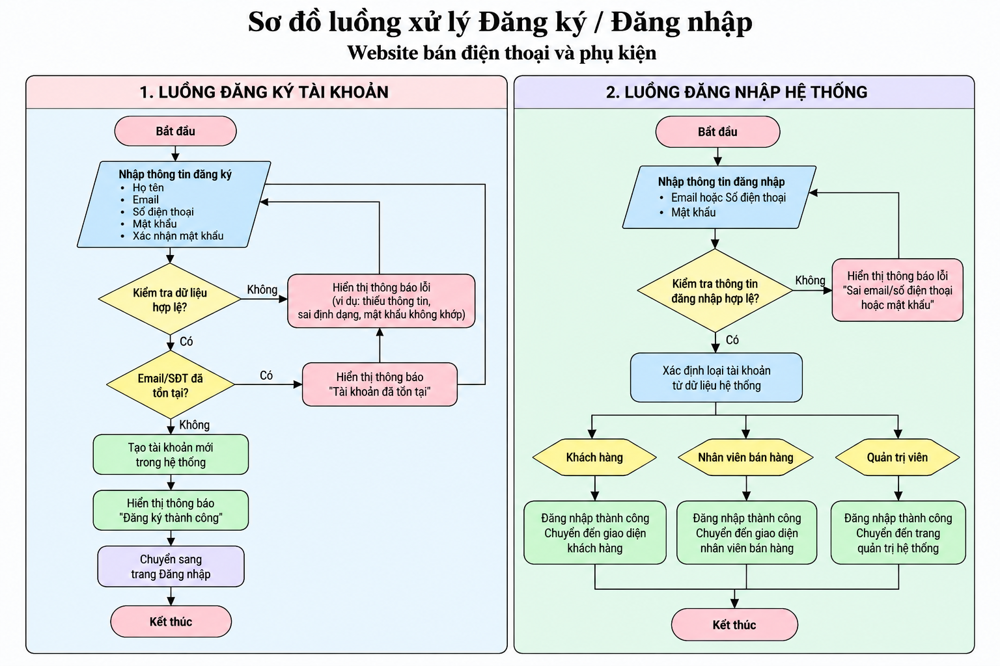

# ĐỒ ÁN KỲ - WEBSITE BÁN ĐIỆN THOẠI VÀ PHỤ KIỆN

## 1. Thông tin sinh viên

- **Họ và tên:** Nguyễn Minh Đức
- **Mã sinh viên (MSSV):** 523100019
- **Lớp:** 5231000A
- **Giảng viên hướng dẫn (GVHD):** Nguyễn Thị Mười Phương

---

## 2. Tên đề tài

**Website bán điện thoại và phụ kiện**

---

## 3. Mục tiêu đề tài

Xây dựng website bán điện thoại và phụ kiện, hỗ trợ khách hàng tìm kiếm, tra cứu, so sánh và đặt mua sản phẩm.

Hệ thống hướng tới các chức năng:

- Hiển thị danh mục điện thoại và phụ kiện theo hãng.
- Hiển thị thông tin và thông số kỹ thuật của sản phẩm.
- Hỗ trợ tìm kiếm, lọc và sắp xếp sản phẩm.
- Hỗ trợ so sánh các sản phẩm.
- Quản lý giỏ hàng.
- Đặt hàng và theo dõi đơn hàng.
- Quản lý sản phẩm.
- Quản lý tồn kho.
- Quản lý đơn hàng.
- Hỗ trợ thông tin bảo hành.

---

## 4. Đối tượng sử dụng

Hệ thống gồm 3 nhóm người dùng chính:

### 4.1. Khách hàng

Khách hàng có thể:

- Đăng ký tài khoản.
- Đăng nhập hệ thống.
- Xem danh sách sản phẩm.
- Tìm kiếm sản phẩm.
- Lọc và sắp xếp sản phẩm.
- Xem chi tiết sản phẩm.
- Xem thông số kỹ thuật.
- So sánh sản phẩm.
- Thêm sản phẩm vào giỏ hàng.
- Quản lý giỏ hàng.
- Đặt hàng.
- Theo dõi trạng thái đơn hàng.

### 4.2. Nhân viên bán hàng

Nhân viên bán hàng hỗ trợ:

- Xem và xử lý đơn hàng.
- Cập nhật trạng thái đơn hàng.
- Quản lý thông tin sản phẩm theo quyền được cấp.
- Theo dõi và cập nhật tồn kho.

### 4.3. Quản trị viên

Quản trị viên có thể:

- Quản lý người dùng.
- Quản lý sản phẩm.
- Thêm, sửa và xóa sản phẩm.
- Quản lý biến thể sản phẩm.
- Quản lý giá bán.
- Quản lý tồn kho.
- Quản lý đơn hàng.
- Theo dõi hoạt động của hệ thống.

---

## 5. Chức năng cốt lõi

Các chức năng chính dự kiến của hệ thống:

1. Danh mục điện thoại và phụ kiện theo hãng.
2. Hiển thị thông số kỹ thuật sản phẩm.
3. Quản lý màu sắc và dung lượng bộ nhớ.
4. Tìm kiếm sản phẩm.
5. Lọc sản phẩm.
6. Sắp xếp sản phẩm.
7. Xem chi tiết sản phẩm.
8. So sánh sản phẩm.
9. Quản lý giỏ hàng.
10. Đặt hàng.
11. Theo dõi đơn hàng.
12. Quản lý sản phẩm.
13. Quản lý tồn kho.
14. Quản lý đơn hàng.
15. Quản lý thông tin bảo hành.

---

## 6. Dữ liệu chính của hệ thống

Hệ thống dự kiến quản lý các nhóm dữ liệu:

- Người dùng.
- Hãng sản xuất.
- Sản phẩm.
- Biến thể sản phẩm.
- Thông số kỹ thuật.
- Màu sắc.
- Dung lượng bộ nhớ.
- Giá bán.
- Tồn kho.
- Giỏ hàng.
- Chi tiết giỏ hàng.
- Đơn hàng.
- Chi tiết đơn hàng.
- Thông tin bảo hành.

---

## 7. Ràng buộc nghiệp vụ

Một số ràng buộc chính:

- Mỗi sản phẩm phải thuộc một hãng sản xuất.
- Một sản phẩm có thể có nhiều biến thể về màu sắc và dung lượng.
- Mỗi biến thể có giá bán và số lượng tồn kho riêng.
- Không cho phép đặt số lượng sản phẩm vượt quá số lượng tồn kho.
- Đơn hàng phải có trạng thái xử lý rõ ràng.
- Người dùng chỉ được sử dụng các chức năng phù hợp với quyền được cấp.
- Thông tin bắt buộc phải được kiểm tra trước khi tạo tài khoản hoặc đặt hàng.

---

## 8. Công nghệ sử dụng

### Giai đoạn hiện tại

- HTML5
- CSS3
- JavaScript
- Responsive Web Design
- Visual Studio Code
- Git
- GitHub

### Công nghệ dự kiến cho các giai đoạn tiếp theo

- Node.js
- Express.js
- EJS
- SQLite
- Postman

> Công nghệ Back-end và cơ sở dữ liệu sẽ được triển khai ở các giai đoạn tiếp theo của đồ án.

---

## 9. Cấu trúc thư mục hiện tại

```text
WEBSITE_BAN_DIEN_THOAI/
│
├── .vscode/
│
├── css/
│   └── style.css
│
├── docs/
│   └── phan-tich-yeu-cau.md
│
├── images/
│   ├── use-case-tongquan.png
│   ├── luong-dang-ky-dang-nhap.png
│   └── ...
│
├── js/
│   └── main.js
│
├── .gitignore
├── index.html
└── README.md
```

---

## 10. Các chức năng giao diện đã xây dựng

Phiên bản giao diện hiện tại đã triển khai một số chức năng cơ bản:

- Hiển thị danh sách điện thoại.
- Phân loại sản phẩm theo hãng.
- Tìm kiếm sản phẩm.
- Sắp xếp sản phẩm.
- Xem chi tiết sản phẩm.
- Hiển thị bảng thông số kỹ thuật.
- Thêm sản phẩm vào giỏ hàng.
- Quản lý giỏ hàng cơ bản.
- Form đặt hàng.
- Chọn sản phẩm để so sánh.
- Hiển thị bảng so sánh thông số sản phẩm.
- Giao diện Responsive cho nhiều kích thước màn hình.

---

## 11. Phân tích hệ thống

### 11.1. Sơ đồ Use Case tổng quan

Sơ đồ Use Case mô tả các tác nhân chính:

- Khách hàng.
- Nhân viên bán hàng.
- Quản trị viên.

File sơ đồ:

```text
images/use-case-tongquan.png
```



### 11.2. Luồng Đăng ký / Đăng nhập

Luồng xử lý bao gồm:

- Đăng ký tài khoản khách hàng.
- Kiểm tra dữ liệu hợp lệ.
- Kiểm tra tài khoản đã tồn tại.
- Đăng nhập hệ thống.
- Kiểm tra thông tin đăng nhập.
- Xác định loại tài khoản.
- Chuyển người dùng đến giao diện phù hợp.

File sơ đồ:

```text
images/luong-dang-ky-dang-nhap.png
```



### 11.3. Tài liệu phân tích yêu cầu

Tài liệu phân tích chi tiết được lưu tại:

```text
docs/phan-tich-yeu-cau.md
```

Tài liệu bao gồm:

- Phân tích yêu cầu nghiệp vụ.
- Phân tích tác nhân.
- Phân tích chức năng.
- Phân tích dữ liệu.
- Phân tích giỏ hàng.
- Phân tích đơn hàng.
- Phân tích quản lý sản phẩm.
- Phân tích tồn kho.
- Các ràng buộc nghiệp vụ.

---

## 12. Hướng dẫn chạy phiên bản hiện tại

### Bước 1: Clone repository

```bash
git clone https://github.com/Minhduc07125/DA_KY_523100019_WEBSITE-B-N-I-N-THO-I.git
```

### Bước 2: Di chuyển vào thư mục dự án

```bash
cd DA_KY_523100019_WEBSITE-B-N-I-N-THO-I
```

### Bước 3: Mở dự án bằng Visual Studio Code

```bash
code .
```

### Bước 4: Chạy website

Có thể mở trực tiếp file:

```text
index.html
```

Hoặc sử dụng extension **Live Server** trong Visual Studio Code để chạy website.

---

## 13. Tiến độ thực hiện

### CP1 - Khởi tạo dự án

- [x] Tạo repository GitHub.
- [x] Khởi tạo cấu trúc dự án.
- [x] Xây dựng giao diện ban đầu.
- [x] Commit và quản lý mã nguồn bằng Git/GitHub.

### CP2 - Phân tích

- [x] Xác định yêu cầu nghiệp vụ.
- [x] Xác định tác nhân của hệ thống.
- [x] Xác định các Use Case chính.
- [x] Xây dựng sơ đồ Use Case tổng quan.
- [x] Phân tích luồng Đăng ký / Đăng nhập.
- [x] Xây dựng sơ đồ luồng Đăng ký / Đăng nhập.
- [x] Phân tích dữ liệu chính.
- [x] Xác định các ràng buộc nghiệp vụ.
- [x] Hoàn thành tài liệu `docs/phan-tich-yeu-cau.md`.

### Các giai đoạn tiếp theo

- [ ] Thiết kế cơ sở dữ liệu.
- [ ] Xây dựng Back-end.
- [ ] Kết nối cơ sở dữ liệu.
- [ ] Hoàn thiện đăng ký và đăng nhập.
- [ ] Hoàn thiện quản lý sản phẩm.
- [ ] Hoàn thiện quản lý tồn kho.
- [ ] Hoàn thiện quản lý đơn hàng.
- [ ] Kiểm thử hệ thống.
- [ ] Hoàn thiện báo cáo đồ án.

---

## 14. Repository

Repository GitHub của đồ án:

`Minhduc07125/DA_KY_523100019_WEBSITE-B-N-I-N-THO-I`

---

## 15. Trạng thái dự án

**Đã hoàn thành CP1 và CP2.**

Dự án hiện đã hoàn thành giai đoạn khởi tạo, xây dựng giao diện cơ bản và phân tích yêu cầu hệ thống. Các chức năng Back-end, cơ sở dữ liệu và quản trị sẽ tiếp tục được phát triển trong các giai đoạn tiếp theo.

---

## Tác giả

**Nguyễn Minh Đức**  
**MSSV: 523100019**  
**Lớp: 5231000A**

Đồ án kỳ - Website bán điện thoại và phụ kiện.
