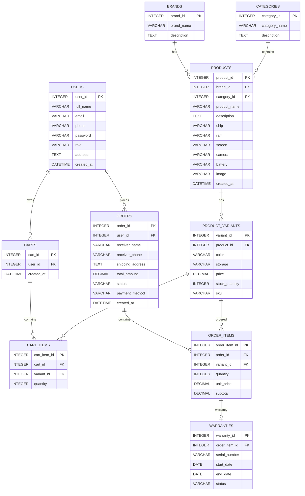

# THIẾT KẾ CƠ SỞ DỮ LIỆU (ERD)

## 1. Thông tin chung

- **Đề tài:** Website bán điện thoại và phụ kiện
- **MSSV:** 523100019
- **Lớp:** 5231000A
- **Giảng viên hướng dẫn:** Nguyễn Thị Mười Phương
- **Giai đoạn:** CP3 - Thiết kế
- **Nội dung:** Thiết kế cơ sở dữ liệu và sơ đồ ERD

---

## 2. Mục đích thiết kế cơ sở dữ liệu

Cơ sở dữ liệu của Website bán điện thoại và phụ kiện được thiết kế nhằm lưu trữ và quản lý tập trung các dữ liệu phát sinh trong hệ thống.

Hệ thống cần quản lý các nhóm dữ liệu chính:

- Người dùng.
- Hãng sản xuất.
- Danh mục sản phẩm.
- Sản phẩm.
- Biến thể sản phẩm.
- Giỏ hàng.
- Chi tiết giỏ hàng.
- Đơn hàng.
- Chi tiết đơn hàng.
- Thông tin bảo hành.

Thiết kế cơ sở dữ liệu phải đảm bảo:

- Hạn chế dữ liệu trùng lặp.
- Dễ dàng truy vấn và cập nhật.
- Đảm bảo tính toàn vẹn dữ liệu.
- Hỗ trợ quản lý tồn kho.
- Hỗ trợ quản lý đơn hàng.
- Có khả năng mở rộng khi phát triển hệ thống.

---

## 3. Các thực thể chính

### 3.1. USERS - Người dùng

Lưu thông tin tài khoản của khách hàng, nhân viên bán hàng và quản trị viên.

| Thuộc tính | Kiểu dữ liệu | Ràng buộc | Mô tả |
|---|---|---|---|
| user_id | INTEGER | PK, AUTOINCREMENT | Mã người dùng |
| full_name | VARCHAR(100) | NOT NULL | Họ và tên |
| email | VARCHAR(150) | UNIQUE, NOT NULL | Email đăng nhập |
| phone | VARCHAR(20) | UNIQUE | Số điện thoại |
| password | VARCHAR(255) | NOT NULL | Mật khẩu đã mã hóa |
| role | VARCHAR(20) | NOT NULL | customer/staff/admin |
| address | TEXT | NULL | Địa chỉ |
| created_at | DATETIME | DEFAULT CURRENT_TIMESTAMP | Ngày tạo |

---

### 3.2. BRANDS - Hãng sản xuất

Lưu thông tin các hãng điện thoại và phụ kiện.

| Thuộc tính | Kiểu dữ liệu | Ràng buộc | Mô tả |
|---|---|---|---|
| brand_id | INTEGER | PK, AUTOINCREMENT | Mã hãng |
| brand_name | VARCHAR(100) | UNIQUE, NOT NULL | Tên hãng |
| description | TEXT | NULL | Mô tả |

Ví dụ:

- Apple
- Samsung
- Xiaomi

---

### 3.3. CATEGORIES - Danh mục sản phẩm

Phân loại sản phẩm trong hệ thống.

| Thuộc tính | Kiểu dữ liệu | Ràng buộc | Mô tả |
|---|---|---|---|
| category_id | INTEGER | PK, AUTOINCREMENT | Mã danh mục |
| category_name | VARCHAR(100) | NOT NULL | Tên danh mục |
| description | TEXT | NULL | Mô tả |

Ví dụ:

- Điện thoại
- Tai nghe
- Sạc
- Ốp lưng
- Phụ kiện

---

### 3.4. PRODUCTS - Sản phẩm

Lưu thông tin chung của từng sản phẩm.

| Thuộc tính | Kiểu dữ liệu | Ràng buộc | Mô tả |
|---|---|---|---|
| product_id | INTEGER | PK, AUTOINCREMENT | Mã sản phẩm |
| brand_id | INTEGER | FK | Mã hãng |
| category_id | INTEGER | FK | Mã danh mục |
| product_name | VARCHAR(200) | NOT NULL | Tên sản phẩm |
| description | TEXT | NULL | Mô tả sản phẩm |
| chip | VARCHAR(100) | NULL | Chip xử lý |
| ram | VARCHAR(50) | NULL | RAM |
| screen | VARCHAR(100) | NULL | Màn hình |
| camera | VARCHAR(100) | NULL | Camera |
| battery | VARCHAR(100) | NULL | Pin |
| image | VARCHAR(255) | NULL | Đường dẫn hình ảnh |
| created_at | DATETIME | DEFAULT CURRENT_TIMESTAMP | Ngày tạo |

**Khóa ngoại:**

- `brand_id` tham chiếu `BRANDS(brand_id)`.
- `category_id` tham chiếu `CATEGORIES(category_id)`.

---

## 4. Biến thể sản phẩm

### 4.1. PRODUCT_VARIANTS - Biến thể sản phẩm

Một sản phẩm có thể có nhiều màu sắc và dung lượng bộ nhớ khác nhau.

Ví dụ:

**iPhone 16 Pro Max**

- 256GB - Titan tự nhiên.
- 512GB - Titan đen.
- 1TB - Titan sa mạc.

| Thuộc tính | Kiểu dữ liệu | Ràng buộc | Mô tả |
|---|---|---|---|
| variant_id | INTEGER | PK, AUTOINCREMENT | Mã biến thể |
| product_id | INTEGER | FK, NOT NULL | Mã sản phẩm |
| color | VARCHAR(50) | NOT NULL | Màu sắc |
| storage | VARCHAR(50) | NULL | Dung lượng |
| price | DECIMAL(15,2) | NOT NULL | Giá bán |
| stock_quantity | INTEGER | DEFAULT 0 | Số lượng tồn kho |
| sku | VARCHAR(100) | UNIQUE | Mã SKU |

**Khóa ngoại:**

`product_id` tham chiếu `PRODUCTS(product_id)`.

Việc tách bảng `PRODUCT_VARIANTS` giúp mỗi màu sắc và dung lượng có giá bán và số lượng tồn kho riêng.

---

## 5. Thiết kế giỏ hàng

### 5.1. CARTS - Giỏ hàng

| Thuộc tính | Kiểu dữ liệu | Ràng buộc | Mô tả |
|---|---|---|---|
| cart_id | INTEGER | PK, AUTOINCREMENT | Mã giỏ hàng |
| user_id | INTEGER | FK, NOT NULL | Người sở hữu |
| created_at | DATETIME | DEFAULT CURRENT_TIMESTAMP | Ngày tạo |

**Khóa ngoại:**

`user_id` tham chiếu `USERS(user_id)`.

---

### 5.2. CART_ITEMS - Chi tiết giỏ hàng

| Thuộc tính | Kiểu dữ liệu | Ràng buộc | Mô tả |
|---|---|---|---|
| cart_item_id | INTEGER | PK, AUTOINCREMENT | Mã chi tiết |
| cart_id | INTEGER | FK, NOT NULL | Mã giỏ hàng |
| variant_id | INTEGER | FK, NOT NULL | Biến thể sản phẩm |
| quantity | INTEGER | NOT NULL | Số lượng |

**Khóa ngoại:**

- `cart_id` tham chiếu `CARTS(cart_id)`.
- `variant_id` tham chiếu `PRODUCT_VARIANTS(variant_id)`.

---

## 6. Thiết kế đơn hàng

### 6.1. ORDERS - Đơn hàng

Lưu thông tin chung của đơn hàng.

| Thuộc tính | Kiểu dữ liệu | Ràng buộc | Mô tả |
|---|---|---|---|
| order_id | INTEGER | PK, AUTOINCREMENT | Mã đơn hàng |
| user_id | INTEGER | FK, NOT NULL | Khách hàng |
| receiver_name | VARCHAR(100) | NOT NULL | Người nhận |
| receiver_phone | VARCHAR(20) | NOT NULL | SĐT người nhận |
| shipping_address | TEXT | NOT NULL | Địa chỉ giao hàng |
| total_amount | DECIMAL(15,2) | NOT NULL | Tổng tiền |
| status | VARCHAR(30) | NOT NULL | Trạng thái |
| payment_method | VARCHAR(50) | NULL | Phương thức thanh toán |
| created_at | DATETIME | DEFAULT CURRENT_TIMESTAMP | Ngày đặt |

### Trạng thái đơn hàng

- Chờ xác nhận.
- Đã xác nhận.
- Đang chuẩn bị hàng.
- Đang giao hàng.
- Đã giao hàng.
- Đã hủy.

**Khóa ngoại:**

`user_id` tham chiếu `USERS(user_id)`.

---

### 6.2. ORDER_ITEMS - Chi tiết đơn hàng

Lưu các sản phẩm thuộc một đơn hàng.

| Thuộc tính | Kiểu dữ liệu | Ràng buộc | Mô tả |
|---|---|---|---|
| order_item_id | INTEGER | PK, AUTOINCREMENT | Mã chi tiết |
| order_id | INTEGER | FK, NOT NULL | Mã đơn hàng |
| variant_id | INTEGER | FK, NOT NULL | Biến thể |
| quantity | INTEGER | NOT NULL | Số lượng |
| unit_price | DECIMAL(15,2) | NOT NULL | Giá tại thời điểm mua |
| subtotal | DECIMAL(15,2) | NOT NULL | Thành tiền |

**Khóa ngoại:**

- `order_id` tham chiếu `ORDERS(order_id)`.
- `variant_id` tham chiếu `PRODUCT_VARIANTS(variant_id)`.

Giá sản phẩm được lưu tại `unit_price` để đảm bảo thông tin đơn hàng cũ không thay đổi khi giá sản phẩm hiện tại được cập nhật.

---

## 7. Thiết kế bảo hành

### 7.1. WARRANTIES - Bảo hành

| Thuộc tính | Kiểu dữ liệu | Ràng buộc | Mô tả |
|---|---|---|---|
| warranty_id | INTEGER | PK, AUTOINCREMENT | Mã bảo hành |
| order_item_id | INTEGER | FK, NOT NULL | Sản phẩm đã mua |
| serial_number | VARCHAR(100) | UNIQUE | Serial/IMEI |
| start_date | DATE | NOT NULL | Ngày bắt đầu |
| end_date | DATE | NOT NULL | Ngày hết hạn |
| status | VARCHAR(30) | NOT NULL | Trạng thái |

**Khóa ngoại:**

`order_item_id` tham chiếu `ORDER_ITEMS(order_item_id)`.

---

# 8. Quan hệ giữa các bảng

Các quan hệ chính trong cơ sở dữ liệu:

1. Một `BRAND` có nhiều `PRODUCT`.
2. Một `CATEGORY` có nhiều `PRODUCT`.
3. Một `PRODUCT` có nhiều `PRODUCT_VARIANT`.
4. Một `USER` có thể có giỏ hàng.
5. Một `CART` có nhiều `CART_ITEM`.
6. Một `PRODUCT_VARIANT` có thể xuất hiện trong nhiều `CART_ITEM`.
7. Một `USER` có thể tạo nhiều `ORDER`.
8. Một `ORDER` có nhiều `ORDER_ITEM`.
9. Một `PRODUCT_VARIANT` có thể xuất hiện trong nhiều `ORDER_ITEM`.
10. Một `ORDER_ITEM` có thể có thông tin bảo hành.

---

# 9. Sơ đồ ERD



---

# 10. Mô hình quan hệ tổng quát

```text
USERS
 ├────────── CARTS
 │             │
 │             └──────── CART_ITEMS
 │                           │
 │                           └──── PRODUCT_VARIANTS
 │                                      │
 └────────── ORDERS                     │
               │                        │
               └──────── ORDER_ITEMS ───┘
                            │
                            └──────── WARRANTIES


BRANDS ───────── PRODUCTS ───────── PRODUCT_VARIANTS
                    │
CATEGORIES ─────────┘
```

---

# 11. Các ràng buộc nghiệp vụ

Hệ thống áp dụng các ràng buộc sau:

1. Email của người dùng không được trùng.
2. Mỗi sản phẩm phải thuộc một hãng sản xuất.
3. Mỗi sản phẩm phải thuộc một danh mục.
4. Một sản phẩm có thể có nhiều biến thể.
5. Mỗi biến thể có màu sắc, dung lượng, giá và tồn kho riêng.
6. Số lượng tồn kho không được nhỏ hơn 0.
7. Số lượng sản phẩm đặt mua phải lớn hơn 0.
8. Không cho phép khách hàng đặt số lượng vượt quá tồn kho.
9. Một đơn hàng phải có ít nhất một sản phẩm.
10. Tổng tiền đơn hàng phải lớn hơn hoặc bằng 0.
11. Người dùng chỉ được thực hiện chức năng phù hợp với quyền tài khoản.
12. Trạng thái đơn hàng phải thuộc các trạng thái được hệ thống quy định.

---

# 12. Chuẩn hóa dữ liệu

Cơ sở dữ liệu được thiết kế theo hướng chuẩn hóa nhằm hạn chế dữ liệu dư thừa.

### Chuẩn 1NF

Mỗi thuộc tính chứa một giá trị đơn.

Ví dụ màu sắc và dung lượng không được lưu chung thành một chuỗi nhiều giá trị trong bảng sản phẩm.

### Chuẩn 2NF

Các thuộc tính không khóa phụ thuộc đầy đủ vào khóa chính của bảng.

Thông tin biến thể được tách khỏi bảng sản phẩm.

### Chuẩn 3NF

Các dữ liệu độc lập như hãng sản xuất và danh mục được tách thành bảng riêng.

Điều này giúp:

- Hạn chế dữ liệu trùng lặp.
- Dễ cập nhật.
- Tăng tính nhất quán.
- Dễ mở rộng hệ thống.

---

# 13. Lựa chọn hệ quản trị cơ sở dữ liệu

Trong giai đoạn triển khai ban đầu, hệ thống dự kiến sử dụng:

**SQLite**

Lý do:

- Gọn nhẹ.
- Không cần cài đặt máy chủ cơ sở dữ liệu riêng.
- Phù hợp với đồ án và quá trình phát triển thử nghiệm.
- Dễ tích hợp với Node.js.
- Có thể chuyển sang MySQL hoặc PostgreSQL khi hệ thống cần mở rộng.

---

# 14. Liên hệ với chức năng hệ thống

Thiết kế cơ sở dữ liệu hỗ trợ trực tiếp các chức năng:

### Khách hàng

- Đăng ký và đăng nhập.
- Xem sản phẩm.
- Tìm kiếm sản phẩm.
- Lọc theo hãng.
- Xem thông số kỹ thuật.
- Chọn màu sắc và dung lượng.
- Thêm sản phẩm vào giỏ hàng.
- Đặt hàng.
- Theo dõi đơn hàng.
- Xem thông tin bảo hành.

### Nhân viên bán hàng

- Xem đơn hàng.
- Xác nhận đơn hàng.
- Cập nhật trạng thái xử lý đơn.

### Quản trị viên

- Quản lý người dùng.
- Quản lý hãng.
- Quản lý danh mục.
- Quản lý sản phẩm.
- Quản lý biến thể.
- Quản lý tồn kho.
- Quản lý đơn hàng.

---

# 15. Kết quả cần đạt

Sau khi hoàn thành thiết kế cơ sở dữ liệu:

- Xác định được các thực thể chính của hệ thống.
- Xác định khóa chính và khóa ngoại.
- Xác định quan hệ giữa các bảng.
- Xác định các ràng buộc dữ liệu.
- Hoàn thành sơ đồ ERD.
- Làm cơ sở để xây dựng SQLite ở giai đoạn lập trình.

---

# 16. Kết luận

Cơ sở dữ liệu của Website bán điện thoại và phụ kiện được thiết kế theo mô hình quan hệ, trong đó sản phẩm và biến thể sản phẩm được tách riêng để quản lý chính xác màu sắc, dung lượng, giá bán và tồn kho.

Thiết kế này đáp ứng các nghiệp vụ chính gồm quản lý người dùng, sản phẩm, giỏ hàng, đơn hàng, tồn kho và bảo hành, đồng thời tạo nền tảng cho việc xây dựng Back-end và API của hệ thống trong các giai đoạn tiếp theo.